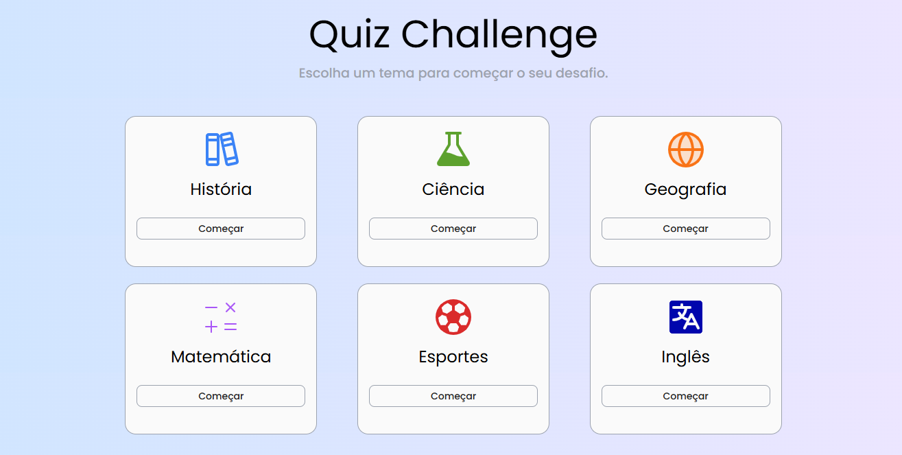

<h1 align="center"> DoYou - Quiz Educativo </h1>

  Uma aplicação de perguntas e respostas para testar seus conhecimentos em diversas matérias escolares.

  <a href="#-tecnologias">Tecnologias</a>&nbsp;&nbsp;&nbsp;|&nbsp;&nbsp;&nbsp;
  <a href="#-projeto">Projeto</a>&nbsp;&nbsp;&nbsp;|&nbsp;&nbsp;&nbsp;
  <a href="#-funcionalidades">Funcionalidades</a>&nbsp;&nbsp;&nbsp;|&nbsp;&nbsp;&nbsp;
  <a href="#-como-rodar">Como Rodar</a>&nbsp;&nbsp;&nbsp;|&nbsp;&nbsp;&nbsp;
  <a href="#memo-licença">Licença</a>

  

 

  

## 🚀 Tecnologias

Esse projeto foi desenvolvido focando no consumo de APIs e lógica de estado no JavaScript puro:

- **HTML5**
- **CSS3** (Variáveis, Flexbox e Grid)
- **JavaScript** (Fetch API, LocalStorage, DOM Manipulation)

## 💻 Projeto

O **DoYou** é um jogo de Quiz onde o usuário pode escolher entre 6 categorias de conhecimento (Matemática, Química, Inglês, Geografia, História e Biologia).
Ao selecionar um tema, a aplicação busca perguntas dinâmicas de uma API externa e inicia a rodada.

- [Acesse o projeto online](https://miqueiassantoss.github.io/DoYou/)

  Feito por <a href="https://github.com/miqueiassantoss">Miqueias Santos</a>

